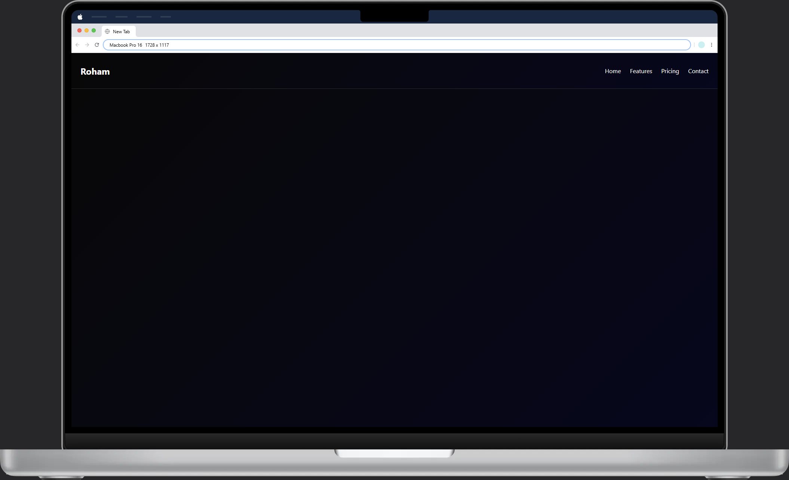

# Responsive Navbar with TailwindCSS

A clean and responsive navigation bar built with TailwindCSS.

## Features
- Desktop + Mobile layout
- Toggle menu button
- Minimal design
- Easy to customize

## Screenshot
 

## What I Learned
- Using Tailwind utility classes for layout
- Responsive design with md: prefix
- Simple JS toggle for mobile menu
